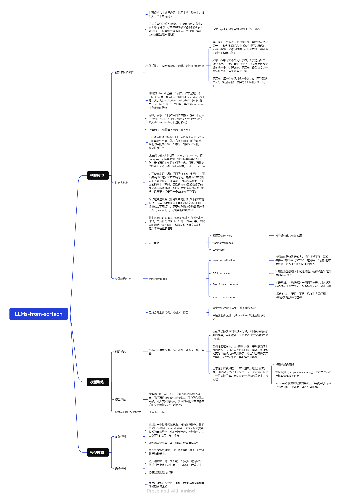

笔记全在note这个文件夹中。目前主流程代码全部实现了一遍，并且加上了用户接口(app)。

关于整体流程，也制作了一张思维导图。




如需运行用户接口app，在当前文件夹中，打开终端，写入

```python
chainlit run app.py
```

即可在本地运行模型实例。

- 由于训练集只用了小规模的英文数据，所以请使用英文回复
- 运行这个对设备要求较高…本地测试的时候，基本得关闭其他所有软件才可以。
- 如需运行，内存至少要有4G以上空闲..!
- 由于文件太大上传不了github，删除了部分数据内容。